# PRACTICA - SERVIDOR [Servicios de red]

Lorién Borra Cruz

## 1 - Configuración de sitios web

www.web1.com, alojado en /var/www/web1. Con fichero de inicio index.html
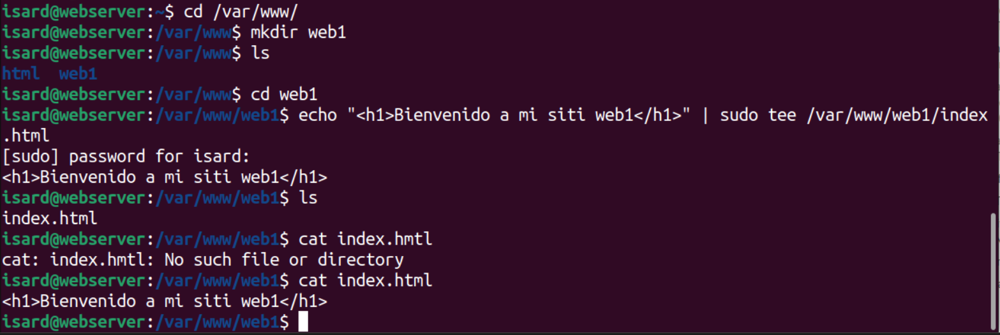 
www.web2.com, alojado en /var/www/web2. Con fichero de inicio index.html
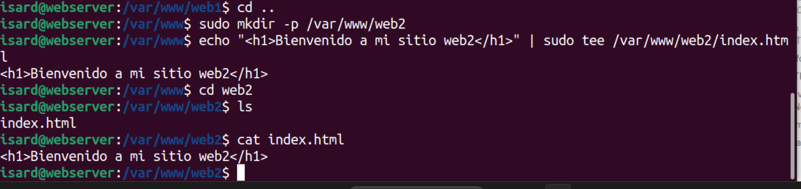 
www.web3.com, alojado en /var/www/web3. Con fichero de inicio index.html
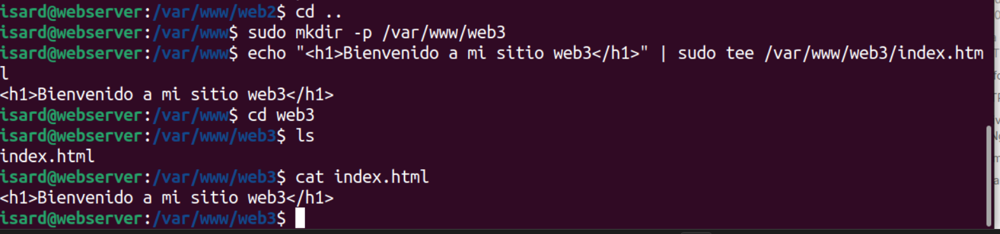 
www.web4.com, alojado en /var/www/web4. Con fichero de inicio index.html
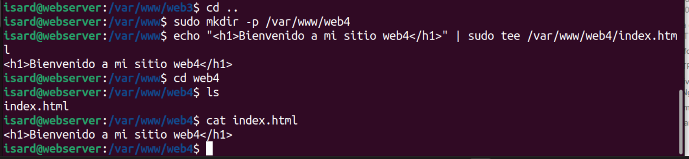 
Luego eh editado y puesto el nombre en todas als web con **sudo** y **nano**
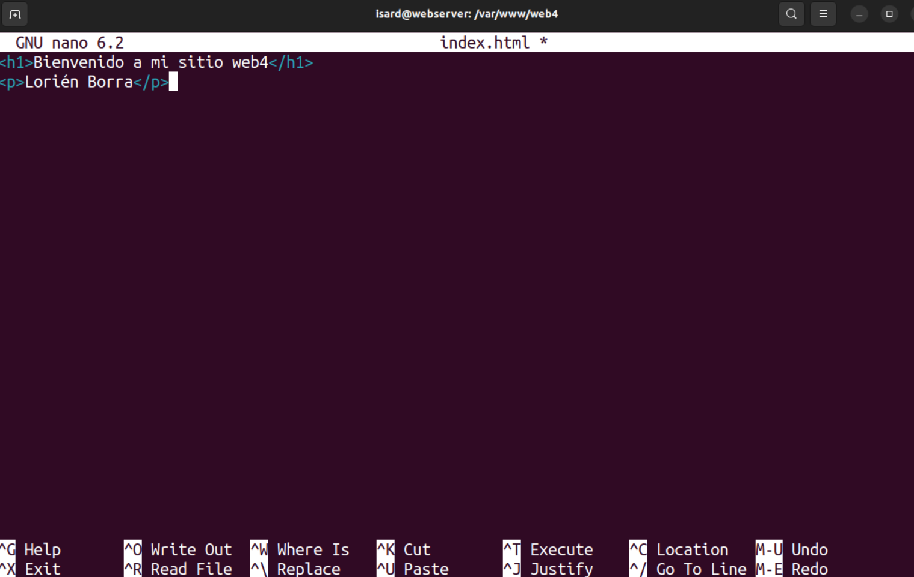 

### - Debes configurar tu fichero hosts en el cliente para poder conectarte a ellos.
Dentro de **/etc/hosts** lso pongo apuntado a al IP del servidor 
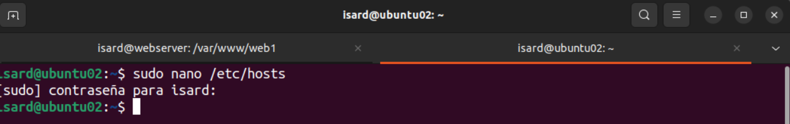 
 
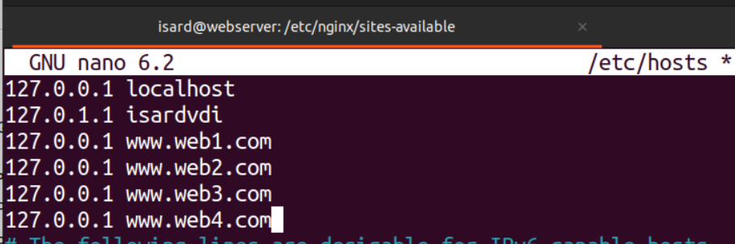 

## 3- Configuración de sitio

### Sitio 1 y 2
 
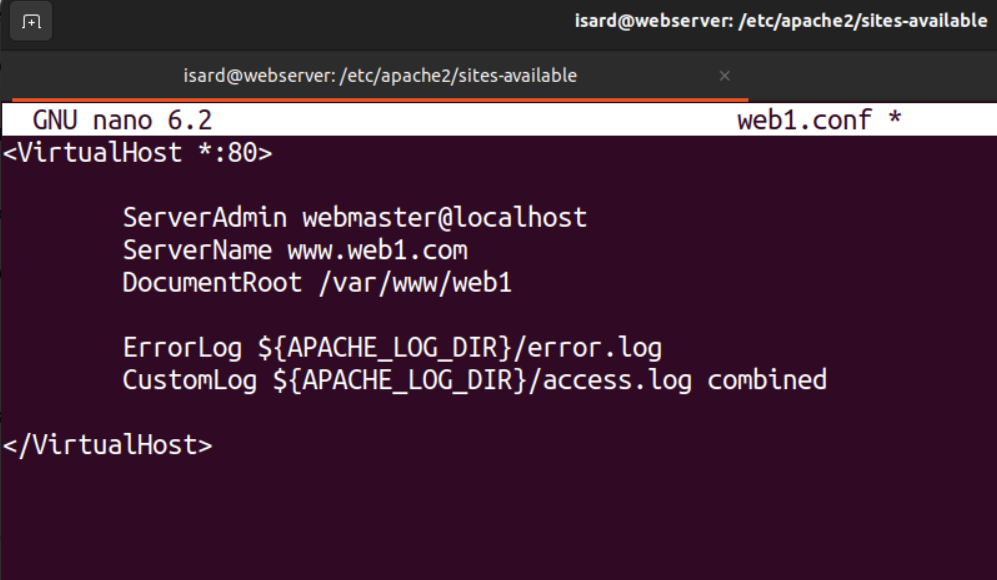 
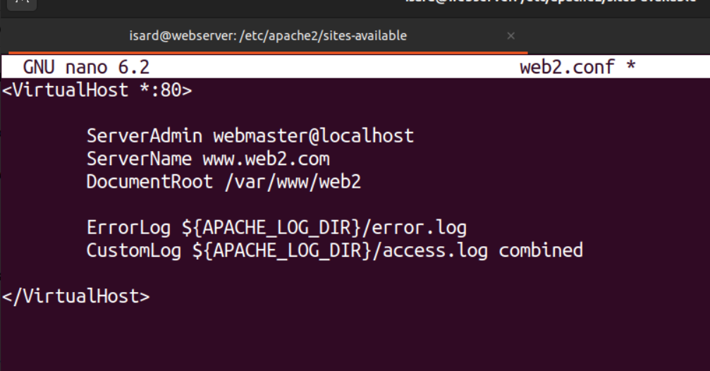 

Después procedo a activarlos siendo en apache con **a2ensite**.
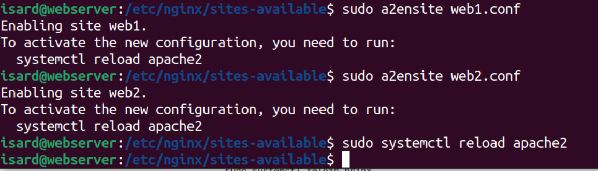 

### Sitio 3 
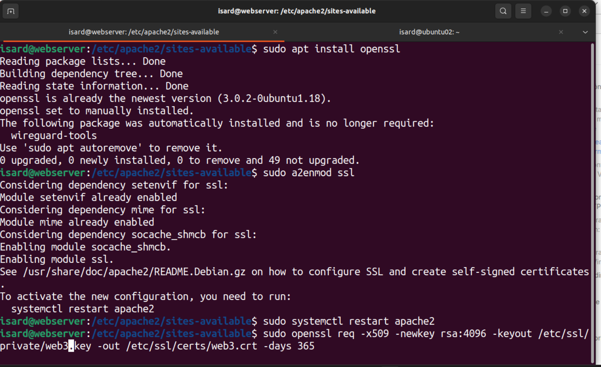 

Abr0 el archivo de configuración del sitio en Apache con **sudo nano /etc/apache2/sites-available/web3.conf**

Añado el siguiente bloque de configuración dentro del archivo para habilitar HTTPS: <VirtualHost *:443> con los correspondientes enlaces del ceritificado.
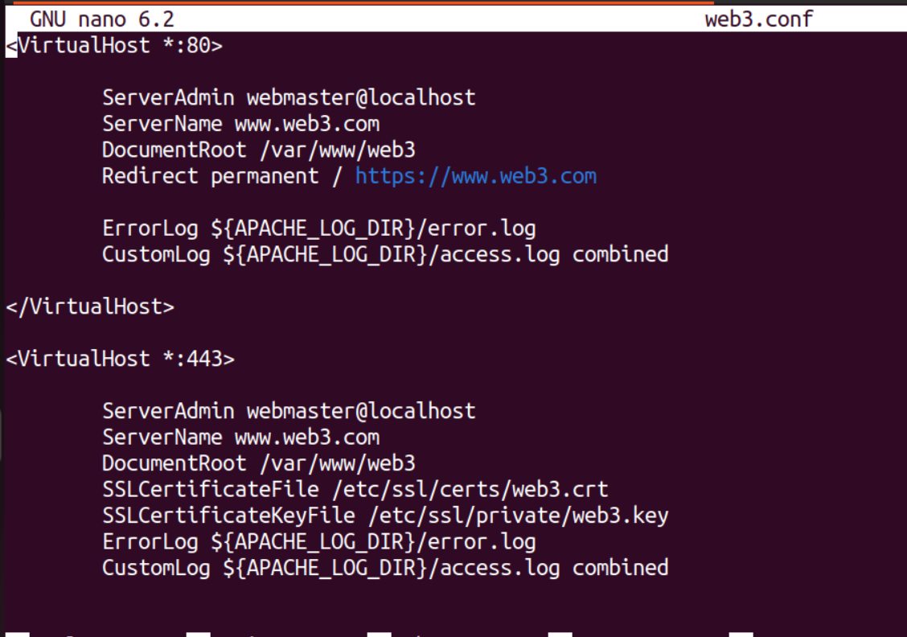 

### Sitio 4

Me situo dentro de la carpeta  **/etc/nginx/sites-available/** y hago `sudo nano web4` y dentro hago la edición de la foto 
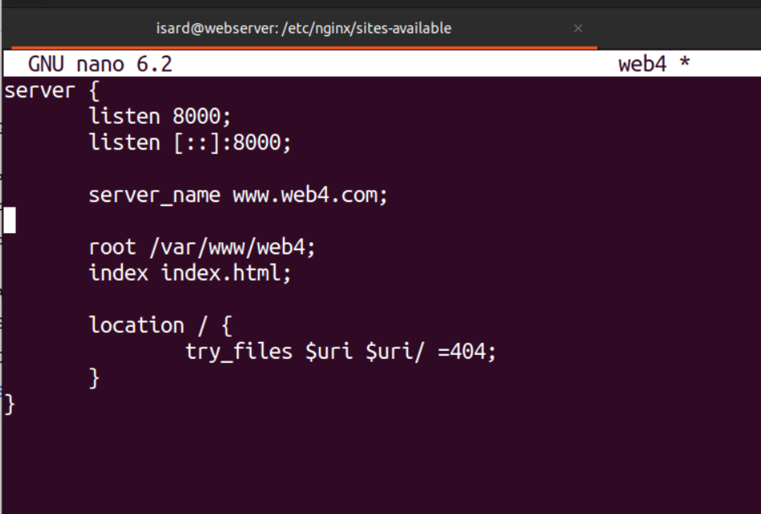 
Luego procedo a activarla con el comando `sudo ln -s /etc/nginx/sites-available/web4 /etc/nginx/sites-enabled/` seguido de `sudo systemctl reload nginx.service` 
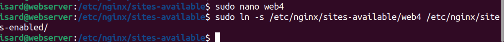 

## 4 - Proxy nginx
Situado ya dentro de nginx sites-available creo el archivo y lo edito y activo finalmente. 
 
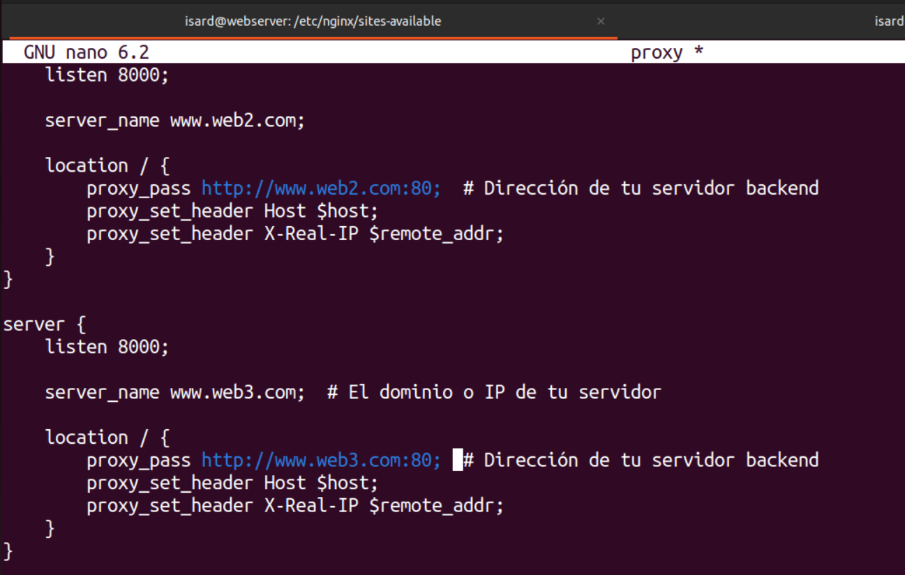 
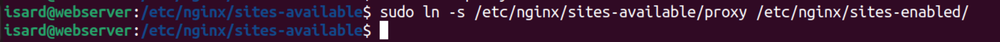 

