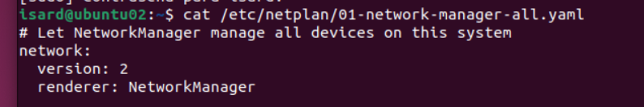
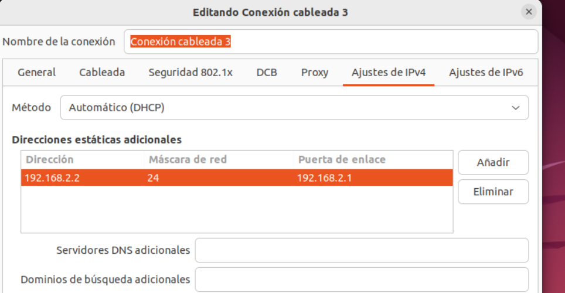
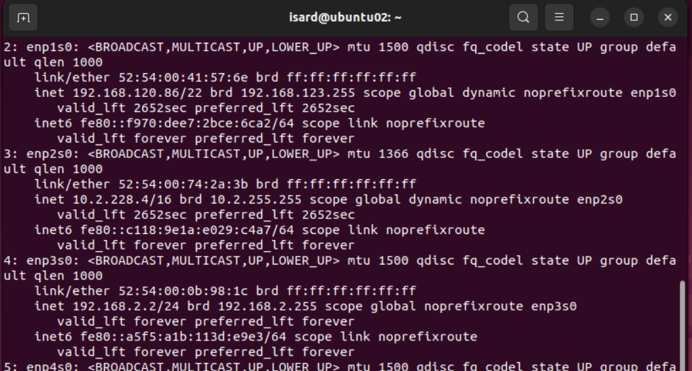
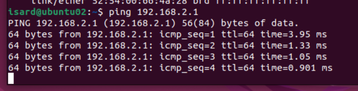

# PRACTICA 1 - SERVIDOR [Servicios de red]

Lorién Borra Cruz

## 1 - Cambiar el nombre de los equipos

### 1. - Cambio del nombre del servidor

Accedo con el comando sudo nano para editar el archivo `/etc/hostname` y pongo mi número de lista que es el 2 -> **02**, después reinicio el server con `sudo reboot`.

Fotos tomadas después del cambio, mostrando los pasos.


### 1.2 - Cambio del nombre del cliente ubuntu

Ejecuto el comando de `hostnamectl set-hostname` e indico el nuevo nombre, después compruebo los cambios ejecutando tan solo `hostnamectl` y veo en static hostname como el nombre ha cambiado, o bien ejecuto `hostname` y me lo indica.

Fotos tomadas después del cambio, mostrando los pasos.


### 1.3 - Cambio de nombre del cliente windows

Dentro de congifuración de sistema, en el apartado ***acerca de*** le doy al botón de 
***cambiar el nombre de este equipo*** e indico el nombre **windows02**.

Fotos tomadas después del cambio, mostrando los pasos.


## 2 - congifuración de la tarjeta de red   

### 2.1 - Configuración del ubuntu server

Para configurar la tarjeta de red debo dirijirme a `/etc/netplan/01-netcfg.yaml` y como voy a editarlo lo hare con **nano** y con **sudo**.


Configuro la tercera tarjeta de red **enp3s0** para que sea estatica y escribo el address que corresponde a mi número, el 02, **192.168.2.1/24**.


Tras aplicar con `netplan apply` veo como los cambios se han actualizado con `ip a`.


### 2.2 - Configuración del cliente ubuntu

Accedo a la configuración de red avanzada, ahí selecciono la tercera tarjeta de red, y en ajustes de IPV4 selecciono el método a ***Manual*** y en dirección ahora le asigno **192.168.2.2** de forma que el cliente ubuntu es el nuevo host 2 y en máscara de red **24**. 


Para confirmar los cambios ejecuto el comando `ip a` y veo como la IP ha cambiado en la tarjeta de red **enp3s0**.


Con ambas maquinas en la red, me queda confirmar la comunicacion entre ambas haciendo ping al servidor **192.168.2.1** y compruebo si las respuestas del servidor son exitosas.


### 2.3 - Configuración del cliente windows

En windows dentro de ***Configuración de red e internet*** selecciono ***Cambiar opciones de adaptador***, y a su vez dentro selecciono la tercera tarjeta de red.


Al seleccionarla accedemos a ***propiedades - protocolo de internet versión 4***, y configuro de nuevo la dirección ip de este host que será el **3** de forma que pongo **192.168.2.3** en máscara de red **255.255.255.0** que es lo mismo que haber puesto 24 en ubuntu.


Una vez configurado y reiniciado hago las pruebas con `ipconfig` desde el terminal y veo el correcto cambio de de la IP.
Luego pruebo la correta comunicación haciendo `ping a 192.168.2.1``.


## 3 - Configuración DHCP en ubuntu server y pruebas clientes

## Configurando DHCP en el ubuntu server
Dado que tengo instalado el servicio DHCP me dirijo directamente a su configuración en el archivo `/etc/dhcp/dhcpd.conf`.
Dentro del archivo hago la configuración de red y su rango, al ser yo 2, la subnet indico **192.168.102.0** y en el rango del
**192.168.102.100** al **192.168.102.200**, y especifico la puerta de enlace predeterminada con ***option routers***.


Después tengo que configurar `/etc/netplan/00-installer-config.yaml` en conreto voy a configurar la 4 tarjeta de red.
La configuro para garantizar, dado que tengo varias tarjetas, que se sea estatica y por tanto enp4s0 tiene la IP estática **192.168.102.1/24**, sirviendo como la puerta de enlace para el resto de clientes DHCP que se quieran conectar a esa red.
Además pongo `dhc4p0: false` pues será el servidor que he configurado quien asiganará las IP según el rango delimitado y además la IP fija sirve para que los clientes sepan donde conectarse, esa puerta de enlace que nombraba antes.


Lo siguiente será acceder a `/etc/default/isc-dhcp-server` y en V4 poner el nombre de la tarjeta de red configurada, **dhc4p0**.


Después procedo a reiniciar DHCP con `sudo systemctl restart isc-dhcp-server` y con `ip a` ver la correcta asignación de la ip a la tarjeta de red. 


Después compruebo que está ejecutandose correctamente con `sudo systemctl status isc-dhcp-server` y que el puerto 67 está en espera.


Preparo la cuarta tarjeta de red de windows y compruebo la dirección obtenida y la conexión mediante ping, esta correcto se asgino la **102**.


Peparo la tarjeta de red en el cliente ubuntu, de forma que el método de asignar ip sea Automático DHCP.
Comprueba la ip con `ip a show enp4s0` o bien `ip a` para ver todas, compruebo que se ha asignado la **103**, mientras que a windows fue la **102**.
Por último prueba la conexión con ping a **192.168.102.1**.


Verifico las leases o préstamos del servidor `dhcp-lease-list` y `/var/lib/dhcp/dhcpd.leases_` .


Configuro una reserva de IP fija en el servidor DHCP, la dirección 50, reinicia el servicio, y renuevo la IP en windows. 
Para ello primeo copio la mac desde la terminal en windows y es la que añado en el ubuntu server en hardware ethernet y modifico
el fixed-address otorgnado 50, con 192.168.102.50 todo ello en /etc/dhcp/dhcpd.conf y después verifico que no ha problemas y 
por último compruebo la ip en windows  con ipconfig en la última tarjeta de red la ip haciendo eso si primero /release y luego /renew.


Por último al apagarlo sigue manteniendola.







  

* [Bienvenido](README.md): Esto es un elemento de lista que contiene un enlace a un

archivo llamado README.md. **ABAJO** sigue la explicación de enlaces.

# Enlaces en Markdown indice:
Los enlaces tienen el formato [Texto del enlace](URL o ruta del archivo):

[Texto]: Es el texto visible en el enlace.

(ruta/archivo.md): Es el archivo o página a la que apunta el enlace.

Ejemplos:

[Introducción](introduccion/README.md): El texto visible será "Introducción", y al 

hacer clic, llevará al archivo README.md que está en la carpeta introduccion.

[GIT](documentacion/git.md): El texto visible es "GIT", y enlaza al archivo git.md en la carpeta documentacion.

## Enlaces e Imágenes dentro del contenido

Puedes agregar [enlaces](https://www.gitbook.com) e imágenes con el mismo formato.

 

# Edición de texto

\*Texto en cursiva\* =  *Texto en cursiva*  

\*\*Texto en negrita\*\* = **Texto en negrita**

\*\*\*Texto en cursiva y en negrita\*\*\* = ***Texto en cursiva y negrita***

\`código en línea\` = `código en línea`

# Listas

## Lista no ordenada
- Elemento 1
- Elemento 2
  - Sub-elemento 2.1
  - Sub-elemento 2.2

## Lista ordenada
1. Primer elemento
2. Segundo elemento
   1. Sub-elemento 2.1
   2. Sub-elemento 2.2

# Encabezado

| Encabezado 1 | Encabezado 2 |
| ------------ | ------------ |
| Celda 1      | Celda 2      |
| Celda 3      | Celda 4      |

# Cita

> Esta es una cita. 
El símbolo de mayor (>) se usa para crear citas en bloque. Cualquier texto precedido por > se muestra en un formato de cita.

# Linea divisoria

\-\-\- linea divisoria 
--- 

> **💡 NOTA:**
> Este es un bloque de nota con cita >

> **⚠️ ADVERTENCIA:**
> Esta es una advertencia con cita >

# Código
Aquí hay un ejemplo de código:

```python
print("Hola Mundo")


