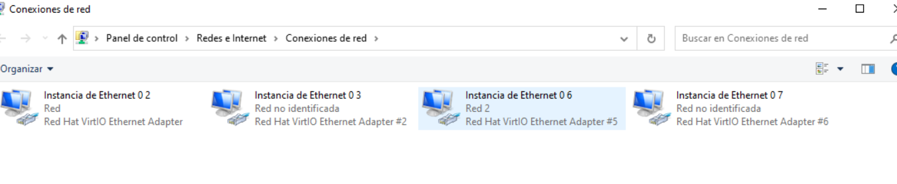

# PRACTICA - SERVIDOR [Servicios de red]

Lorién Borra Cruz

## 1 - Cambiar el nombre de los equipos

### 1. - Cambio del nombre del servidor

Accedo con el comando **sudo nano** para editar el archivo `/etc/hostname` y pongo mi número de lista que es el 2 -> **02**, después reinicio el server con `sudo reboot`.

Fotos tomadas después del cambio, mostrando los pasos y resultado.  
  
  
  
 

### 1.2 - Cambio del nombre del cliente ubuntu

Ejecuto el comando de `hostnamectl set-hostname` e indico el nuevo nombre, después compruebo los cambios ejecutando tan solo `hostnamectl` y veo en ***static hostname*** como el nombre ha cambiado, o bien ejecuto `hostname` y me lo indica.

Fotos tomadas después del cambio, mostrando los pasos.  
  
 

### 1.3 - Cambio de nombre del cliente windows

Dentro de configuración de sistema, en el apartado ***acerca de*** le doy al botón de 
***cambiar el nombre de este equipo*** e indico el nombre **windows02**.

Fotos tomadas después del cambio, mostrando los pasos.  
 

## 2 - Congifuración de la tarjeta de red   

### 2.1 - Configuración del ubuntu server

Para configurar la tarjeta de red debo dirijirme a `/etc/netplan/01-netcfg.yaml` y como voy a editarlo lo hare con **nano** y con **sudo**. 
 

Configuro la tercera tarjeta de red **enp3s0** para que sea estática y escribo el address que corresponde a mi número, el 02, **192.168.2.1/24**.  
 

Tras aplicar con `netplan apply` veo como los cambios se han actualizado con `ip a`.  
 

### 2.2 - Configuración del cliente ubuntu

Accedo a la configuración de red avanzada, ahí selecciono la tercera tarjeta de red, y en ajustes de IPV4 selecciono el método a ***Manual*** y en dirección ahora le asigno **192.168.2.2** de forma que el cliente ubuntu es el nuevo host 2 y en máscara de red **24**.   
  
  
 

Para confirmar los cambios ejecuto el comando `ip a` y veo como la IP ha cambiado en la tarjeta de red **enp3s0**.  
 

Con ambas maquinas en la red, me queda confirmar la comunicacion entre ambas haciendo ping al servidor **192.168.2.1** y compruebo si las respuestas del servidor son exitosas.  
 

### 2.3 - Configuración del cliente windows

En windows dentro de ***Configuración de red e internet*** selecciono ***Cambiar opciones de adaptador***, y a su vez dentro selecciono la tercera tarjeta de red.  
  
 

Al seleccionarla accedemos a ***propiedades - protocolo de internet versión 4***, y configuro de nuevo la dirección ip de este host que será el **3** de forma que pongo **192.168.2.3** en máscara de red **255.255.255.0** que es lo mismo que haber puesto 24 en ubuntu.  
  
 

Una vez configurado y reiniciado hago las pruebas con `ipconfig` desde el terminal y veo el correcto cambio de de la IP.
Luego pruebo la correcta comunicación haciendo `ping a 192.168.2.1``.  
  
 

## 3 - Configuración DHCP en ubuntu server y pruebas clientes

### Configurando DHCP en el ubuntu server
Dado que tengo instalado el servicio DHCP me dirijo directamente a su configuración en el archivo `/etc/dhcp/dhcpd.conf`.
Dentro del archivo hago la configuración de red y su rango, al ser yo 2, la subnet indico **192.168.102.0** y en el rango del
**192.168.102.100** al **192.168.102.200**, y especifico la puerta de enlace predeterminada con ***option routers***.  
  
 

Después tengo que configurar `/etc/netplan/00-installer-config.yaml` en concreto voy a configurar la 4 tarjeta de red.
La configuro para garantizar, dado que tengo varias tarjetas, que se sea estatica y por tanto enp4s0 tiene la IP estática **192.168.102.1/24**, sirviendo como la puerta de enlace para el resto de clientes DHCP que se quieran conectar a esa red.
Además pongo `dhc4p0: false` pues será el servidor que he configurado quien asiganará las IP según el rango delimitado y además la IP fija sirve para que los clientes sepan donde conectarse, esa puerta de enlace que nombraba antes.  
  
 

Lo siguiente será acceder a `/etc/default/isc-dhcp-server` y en V4 poner el nombre de la tarjeta de red configurada, **dhc4p0**.  
  
 

Después procedo a reiniciar DHCP con `sudo systemctl restart isc-dhcp-server` y con `ip a` ver la correcta asignación de la ip a la tarjeta de red.   
  
 

Después compruebo que está ejecutandose correctamente con `sudo systemctl status isc-dhcp-server` y que el puerto 67 está en espera.  
  
 

### Configurando DHCP en el cliente ubuntu

Peparo la tarjeta de red en el cliente ubuntu, de forma que el método de asignar ip sea Automático DHCP.
Comprueba la ip con `ip a show enp4s0` o bien `ip a` para ver todas, compruebo que se ha asignado la **103**, mientras que a windows fue la **102**.
Por último prueba la conexión con ping a **192.168.102.1**.  
 
 
 

### Configurando DHCP en el cliente windows
Preparo la cuarta tarjeta de red de windows y compruebo la dirección obtenida y la conexión mediante ping, esta correcto se asgino la **102**.  
  
  
 

Verifico las leases o préstamos del servidor `dhcp-lease-list` y `/var/lib/dhcp/dhcpd.leases_` .  
 
 

Configuro una reserva de IP fija en el servidor DHCP, la dirección 50, reinicio el servicio, y renuevo la IP en windows. 
Para ello primeo copio la mac desde la terminal en windows y es la que añado en el ubuntu server en **hardware ethernet** y modifico el **fixed-address** otorgando **50**, quedando **192.168.102.50** todo ello editado en `/etc/dhcp/dhcpd.conf` y después verifico que no ha problemas.  
 
 
 

Por último compruebo la ip en windows con ipconfig en la última tarjeta de red la ip haciendo eso si, primero /release y luego /renew.  
 
 
 

Por último al apagarlo sigue manteniendola.  
 
 

  

