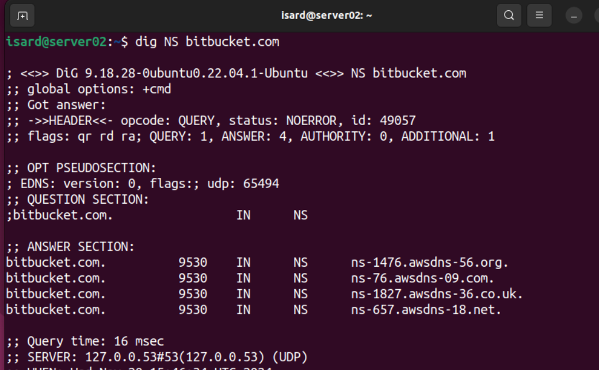

Práctica 2. DNS

Servicio de DNS

## Objetivos

- Conocer el funcionamiento del servicio DNS
- Conocer los distintos registros asocidados a un dominio DNS.
- Conocer cómo suplantar el DNS de forma local.

## Qué entregar

- Toma el fichero markdown del repositorio del profesor y añádelo a tu repositorio de prácticas
- Añade los comentarios y fotos que expliquen y justifiquen tu trabajo.
- Vamos aprovechar esta práctica para aprender a añadir etiquetas en git:
  - https://git-scm.com/book/es/v2/Fundamentos-de-Git-Etiquetado
  - Definie una etiqueta P1 asocida al commit con el que terminas tu trabajo. Puedes hacerlo de una de estas maneras:
    - `git tag -a P2 <hash del commit>`
    - `git tag -a P2 -m 'Práctica 2 acabada'`
  - Sube tu trabajo y la etiqueta:
    - `git push origin P2`  //para subir la etiqueta
    - `git push origin --tags` //para subir todas las etiquetas
- Respeta la fecha de entrega.

### Herramientas de diagnóstico

- Toma un dominio público de acuerdo a tu número de alumno:
  1. gitlab.com
  2. bitbucket.com
  3. android.com
  4. trello.com
  5. atlassian.com
  6. ibercaja.es
  7. facebook.com
  8. twiter.com
  9. bbva.es
  10. instagram.com
  11. wikipedia.com
  12. elpais.com
  13. marca.com
  14. heraldo.es
  15. apple.com

- Intenta resolver las siguientes preguntas con con las 3 herramientas presentadas: host,nslookup y dig.
> Primero me conecto por ssh a mi servidor con **ssh isard@192.168.2.1**
  
  - Busca la IP asignada
  > Ejecuto **host bitbucket.com**
  > Obtengo 3 siendo estas: **186.166.142.21** | **186.166.142.22** |**186.166.142.23**
  >  
  > Ejecuto **nslookup bitbucket.com** y obtengo los mismos resultados.
  >  
  > Ejecuto **dig bitbucket.com** y obtengo los mismos resultados en ***ANSWER SECTION***
  >  

  - Quien resuelve su DNS
  > Ejecuto **nslookup NS bitbucket.com** y obtengo cuatro resultados en ***ANSWER SECTION*** siendo estos: **ns-1476.awsdns-56.org.** | **ns-76.awsdns-09.com.** | **ns-1827.awsdns-36.co.uk.** | **ns-657.awsdns.18.net.**
  >  
  > Ejecuto **dig bitbucket.com NS** y obtengo los mismos resultados
  >  
  > Ejecuto **host -t ns bitbucket.com** y lo mismo.
  >  

  - Cuál es el servidor de correo electrónico. Si hay varios, determina cual es primero por su prioridad.
  > Ejecuto el siguiente comando **host -t MX bitbucket.com** y la respuesta que recibo es que no hay no hat record de MX para ese dominio.
  >  
  > Con **dig** ejecuto el comando **dig bitbucket.com MX**
  >  
  > Con **nslookup** ejecuto el comando **nslookup -query=mx bitbucket.com**
  >  

  - Haz la búsqueda de forma autorizada, es decir, que el servidor que contesta sea uno de los registos NS del dominio.
  > He de usar alguno de los obtenidos en el paso 2, como puede ser **ns-1476.awsdns-56.org.**
  > Ejecuto el siguiente comando de **dig** con esa direccion **dig <servidorDNS> dominio A** por tanto **dig ns-1476.awsdns-56.org. bitbucket.com A** .
  >  
   >  
  > Con **lookup** ejecuto el comando **nslookup bitbucket.com ns-1476.awsdns-56.org**
  >  

### Suplantar servicio DNS localmente.

- Edita el fichero `/etc/hosts` para que resuelva un nombre de dominio falso con el siguiente esquema: 
  - `miapellido.local` asociado a la dirección 127.0.0.1
  - `miapellido.es` asociado a una dirección pública inventada.
  - `miapellido.com` asociado a la dirección del dominio de la primera parte de la práctica. Si eres el nº 1 sería `github.com`
  >   
- Comprueba la resolución de los tres registros con alguna de las herramientas de diagnóstico.
>   
>   
>   
- Comprueba la misma resolución pero haciendo que el servidor consultado sea el 8.8.8.8
>   
>   
>   
> A considerar, en .es y .local aparece **status: NXDOMAIN** lo cual indica que el dominio no existe en los servidores DNS de Google,
> ni en ningún DNS público. Además aparece **ANSWER: 0:** lo que indica que no hay registros A, ya que el dominio no existe.
> Por último **AUTHORITY SECTION:** Muestra información del servidor autoritativo para el TLD (.es). Aquí se ve un servidor relacionado 
> con el registro .es (por ejemplo, a.nic.es), que confirma que el dominio no está registrado.
> *** La rzón es que el comando dig @8.8.8.8 está consultando un servidor DNS externo que no tiene información sobre mi configuración local en /etc/hosts ***
>   
> Aqui en cambio **status: NOERROR** Indica que el dominio existe y que el servidor DNS tiene registros asociados para él.
> De hecho en **ANSWER SECTION:** Ahora si muestra los registros de tipo A (direcciones IPv4) asociados al dominio, tiene dos registros A.
### Configuración del servidor  DNS con BIND9
sudo vim db.cabeza.edu
Dentro de /etc/bind ns1.borra.edu. admin.borra.edu. (
  1; Serial
  el resto igual

)

@  IN  NS dns1.borra.edu.
@  IN  NS dns2.borra.edu.
dns1  IN  A 192.168.102.1
dns2  IN  A 192.168.102.2
mail  IN  A 192.168.102.1
mail2  IN  A 192.168.102.2
www  IN  A 192.168.102.3
shop IN CNAME www
@  IN  MX 20 mail.borra.edu
@  IN  MX 10 mail2.borra.edu

- Configura el dominio `miapellido.edu` en bind9. Debes hacerlo:
  > Compruebo que **bind9** este activo.
  >  
  - En el servidor linux
  - Conectándote al mismo mediante SSH
  - Utiliza las direcciones IP de tu red privada (192.168.1xx.0/24)
  > He de configurar BIND9 desde **/etc/bind/** en concreto `sudo nano /etc/bind/named.conf.local` y lo configuro con mis datos.
  > El archivo **/etc/bind/named.conf.local** es donde puedo definir zonas de DNS locales y es el servidor BIND quien las gestiona.
  > Cuando creo una **zone** como ***borra.edu*** en ese archivo, BIND que debe gestionará zona para el dominio ***borra.edu*** y como Además
  > establezo en la zone **file "/etc/bind/db.borra.edu"** con esto le indico a BIND cómo resolver las consultas para ese dominio y qué 
  > archivo de zona debe usar para obtener la información.
  > Por tanto, El archivo **named.conf.local** simplemente le dice a BIND qué archivo de zona utilizar para gestionar las consultas de **borra.edu** 
  > Luego, BIND consulta **/etc/bind/db.borra.edu** para obtener la información.

  >Proceso de resolución de consultas:
  >1 - Cuando quiero acceder a borra.edu, el servidor de nombres BIND consultará su archivo de configuración (el que contiene la zone borra.edu).
  >2 - Como he configurado la zona para borra.edu en **named.conf.local**, BIND va a buscar la información correspondiente en el archivo de zona **/etc/bind/db.borra.edu**.
  >3 - Si el archivo de zona contiene un registro A para www.borra.edu, así lo he hecho, BIND responderá con la dirección IP configurada en ese archivo.
  >  
  - Deberás usar un fichero con un nombre similar a este: *db.miapellido.edu*
  >  
  
- Debes definir:
  - Número de versión 1
  - Un correo de administrador dentro del dominio.
  - Dos registros MX.
  - Dos registros NS con máquinas del propio dominio (por ejemplo *dns1* y *dns2*).
  - Varios registros A, al menos: *www, dns1, dns2*
  - Un registro CNAME asociado a la misma dirección que *www*
   >Para ello accedo al archivo con `sudo nano /etc/bind/db.borra.edu` y lo edito con el resultado de la segunda foto:
   >  
   >  
   > La primera línea de **SOA** establece el registro SOA el cual indica que este archivo de zona es la autoridad para el dominio borra.edu, es al cabecera
   > que decalra quien controla la configuración de ese dominio de zona. He de establecer un servidor DNS principal y el correo 
   > electronico del administrador del dominio.
   > Ojo he dcalrado cual sera el servidor NDS principal, pero he de configurarlo si o si luego en el archivo, por tanto si he declarado **dns1.borra.edu.** Como
   > principal implica que debo decalrar un dns llamado **dns1** (mismo nombre quitando el dominio de zona). Le asigno obviamente una IP que será ese servidor
   > el que gestionara las peticiones **dns1    IN  A   192.168.2.1** el servidor ubuntu, es decir la IP 192.168.2.1 es una máquina configurada como servidor DNS y así
   > cualquier cliente o servidor que intente contactar con **dns1.borra.edu.** sabrá a qué IP conectarse, lo que hará que las consultas no fallen y responderá el servidor
   > las peticiones.
   > El símbolo **@** en el archivo de zona es un alias que se utiliza en los archivos de zona de BIND para hacer referencia al dominio principal de la zona, 
   > que en mi caso es **borra.edu**. Es una forma abreviada de referirse a la raíz del dominio, sin tener que escribir borra.edu.
   >**A**: Apunta directamente un nombre de dominio a una dirección IP, asocia un nombre de dominio a una dirección IP en formato IPv4. Por tanto, cuando se
   > acceda a **borra.edu*+ el dominio tal cual definido para la zona se resolverá a 10.1.1.1, que es la IP que has asignado en el registro A.
   >**www**: En cambio aqui defino que cuando el dominio de la zona, vaya precedido de **www** es decir, **www.borra.edu** al establecer **www  IN  A   10.1.1.1**
   > configuro que www.borra.edu debe resolver a la dirección IP 10.1.1.1, pero podría poner otra distinta.
   >**CNAME**:Apunta un nombre de dominio a otro dominio. Lo utilizo para que los subdominios  que defina apunten al mismo lugar, con CNAME esos subdominios "apuntan" al dominio principal.
   > He configurado 2 subdominio, uno es **info** y lo he configurado en un registro CNAME así **info   IN  CNAME   www.borra.edu.**, logrando ahora que apunte a **www.borra.edu** , por tanto,
   > cuando se acceda a **info.borra.edu** el servidor DNS va a buscar **www.borra.edu**, porque es lo que se ha definido en el registro CNAME. A su vez,  www.borra.edu tiene un registro A apuntando a 10.1.1.1, 
   > y por tanto la resolución de info.borra.edu también devolverá **10.1.1.1**.
   > En definitiva apunta un nombre de dominio a otro dominio y ese segundo dominio puede tener un registro A que apunte a una IP como este caso.
- Para comprobar que tu configuración es correcta debes:
  - Usar el comando de verificación sintáctica.
  > Ejecuto estos 2 comandos `sudo named-checkconf` y `sudo named-checkzone borra.edu /etc/bind/db.borra.edu`.
  >  
  - Reiniciar el servicio
  > Lo reinicio y lo vuelvo a comprobar otra vez.
  >  
  - Probar la resolución usando nslookup y dig. Ojo, la resolución de nombres debe correr a cargo del servidor Ubuntu.
  > Dig: www.borra.edu
  >  
  > Dig: info.borra.edu
  >  
  > Dig: borra.edu
  >  

  > Nslookup: www.borra.edu tanto local como desde el server.
  >  
  >  
  > Nslookup: info.borra.edu tanto local como desde el server.
  >  
  >  
  > Nslookup: borra.edu tanto local como desde el server.
  >  
  >  
- Trabajo extra. Para mejorar tu calificación se te propone:
  - Añadir una zona de resolución inversa
  > La red que he usado en el ejercico es la red 192.168.2.0/24, la ya configurado en la práctica 1, soy el número 2 de la lista.
  > Por tanto, el dominio y en consecuencia la zone será **2.168.192.in-addr.arpa**
  > Para ello edito en `sudo nano /etc/bind/named.conf.local`
  >  
  > Después creo el archivo de zona de para esta resolución inversa.
  >  
  > Después procedo a editar el archivo.
  >  
  >  
  > Hago las comprobaciones y reinicio
  >  

  - Instalar Bind9 en el cliente Ubuntu y definirlo como DNS esclavo del primero.