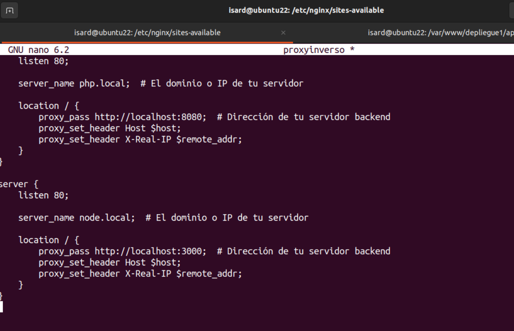
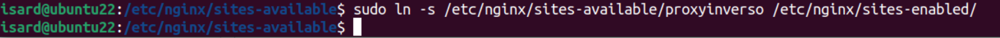

# PRÁCTICA 3 LORIEN BORRA

### Creación de usuario en MySQL para la práctica

Primero accedo con sudo a mysql: `sudo mysql`  

- **Creo un usuario demo para la practica y  para conexiones desde cualquier dirección**:   

`CREATE USER 'demo'@'%' IDENTIFIED BY 'password';`  
  

### CREACIÓN DE UNA BBDD Y OTORGAR PERMISOS
1. Creo la base de datos desde terminal:  
`CREATE DATABASE demo;`  
Esto creará una base de datos llamada demo.  

2. Otorgo permisos al usuario demo  
Otorgo todos los privilegios sobre la base de datos demo al usuario demo:  
`GRANT ALL PRIVILEGES ON demo.* TO 'demo'@'%';`  

3. Aplico los cambios
Ejecuto el siguiente comando para recargar los privilegios y asegurarme de que los cambios surtan efecto:  
`FLUSH PRIVILEGES;`  

  

### PROCESO SERVIR SITIO SOLO CON APACHE

- Clono directamente en el directorio actual  
Estoy en el directorio donde quiero que se cree el repositorio, en **/var/www/** simplemente ejecuto el comando git clone y Git creará un subdirectorio con el nombre del repositorio pero añado el personalziado **depliegue1**.
`git clone https://github.com/rafacabeza/demoappphp depliegue1`  
Esto crea un subdirectorio llamado **depliegue1** en vez de **demoppphp**.  

1. Importo el archivo SQL:   
`mysql -u usuario -p BBDD < /ruta/al/archivo.sql`   
`mysql -u demo -p demo < /var/www/depliegue1/demo.sql`  
  

2. Verifico la importación:  
Vuelvo a conectarme a MySQL y selecciono la base de datos demo para ver que esta correcto:  
`mysql -u demo -p`  
`USE demo;`  
`SHOW TABLES;`  
  

3. Configuro los dominios en **/etc/hosts**  
  

4. Apache recibe la solicitud  
Apache, que está escuchando en el puerto 80 (por defecto), pero yo lo he cambiado al 8080, en el archivo **/etc/apache2/ports.conf** .   
  

5. Apache busca el Virtual Host correspondiente  
Apache revisa los archivos de configuración de los Virtual Hosts para encontrar uno que coincida con el dominio solicitado (php.local). Estos archivos están en el directorio **/etc/apache2/sites-available**.
En mi caso, creo ese archivo en ese directorio, el archivo de configuración es **despliegue1.conf** y contiene estos datos:  
  

6. El archivo .conf que he creado antes debe estar habilitado  
Para que Apache utilice el archivo de configuración del Virtual Host debe estar habilitado. Esto se hace creando un enlace simbólico en el directorio **/etc/apache2/sites-enabled/**.
Ejecuto: **sudo a2ensite despliegue1.conf**   
Apache crea un enlace simbólico desde **/etc/apache2/sites-available/demo.conf** a **/etc/apache2/sites-enabled/demo.conf**.  
  

7. Configuro el archivo index.php dentro de ***/var/www/depliegue1/app/index.php*** con las nuevas credenciales que hice en mysql.  
  

8. Apache sirve el archivo al navegador  
Finalmente, Apache encuentra el archivo especificado (por ejemplo, /var/www/demo/index.php), lo procesa (si es un archivo PHP, lo pasa al intérprete de PHP), y envía el resultado al navegador.  
  

### APLICACIÓN CON NODE

- Clonar directamente en el directorio actual  
Si estoy en el directorio donde quiero que se cree el repositorio, simplemente ejecuto el comando git clone y Git creará un subdirectorio con el nombre del repositorio.
`isard@isard:~/proyectonode$ git clone https://github.com/rafacabeza/demoapinode despliegue2`  
Esto creo un subdirectorio llamado **despliegue2** dentro del directorio raiz **~/**.  
  

**¿Qué pasa después de clonar el repositorio?**
Accedo al directorio clonado `cd despliegue2` e instalo las dependencias del proyecto, las instalo las con `npm install`.  
Configuro la base de datos con las nuevas credenciales y otros parámetros.  
  
  

Ejecuto la aplicación con `npm start`  

**Problema al hacer `npm install`** lo solucioné dando permisos al usuario actual sobre el proyecto, para ello verifque si isard es el dueño o es root:  
`ls -ld /home/isard/demoapinode`   
Como efectivamente es root cambio el ownership y doy permisos:  
`sudo chown -R $USER:$USER /home/proyectonode/demoapinode`  
`sudo chmod -R 775 /home/isard/demoapinode`  

**Pasos que he seguido para importar el archivo SQL del proyecto node en la misma BBDD demo**  
  

### NGINX COMO PROXY INVERSO DE NODE Y APACHE

1. Configuración de Nginx como proxy inverso
Creo un archivo para el proxy inverso en el directorio **sites-available** dentro  a su vez del directorio **nginx** y establezo un bloque de servidor para cada dominio, por tanto, edito el archivo de 
configuración de Nginx o creo uno nuevo para manejar los dominios. Hice:  
`sudo nano /etc/nginx/sites-available/proxyinverso`   
En el archivo agrego los bloques de cada dominio:  

  

Lo releventa es **listen** donde pongo un puerto distinto al de apache y node, el ^**80** y luego **server_name** donde pongo el nombre de dominio, y **proxy_pass** donde pongo la url con el puerto de su servidor ya sea el de apache o node.  

Después debo habilitar la configuración, es decir que aparezca correcto en sites-enabled, para ello
creo un enlace simbólico para habilitar la configuración:  
`sudo ln -s /etc/nginx/sites-available/proxy-config /etc/nginx/sites-enabled/`  

  

`sudo systemctl restart nginx`  

Resultados en puerto 80:  
  
  

