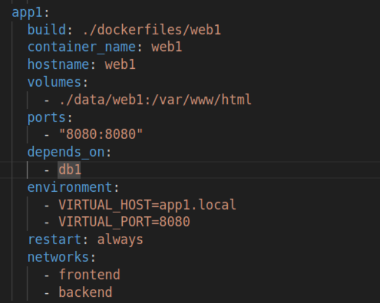

# PRACTICA DOCKER
## CONFIGURACIÓN CONTENEDOR MYSQL
```yaml
- ./data/db:/var/lib/mysql
```
**/var/lib/mysql** En esta carpeta MySQL guarda los datos de las bases de datos, montando este volumen
los datos de MySQL son persistentes y no se perderán elimine o reinicie el contenedor. Vinculo maquina local - contenedor.
```yaml
- volumen1:/docker-entrypoint-initdb.d
```
**DB1**<br><br>
<br><br>
**VOLUMENES PERSONALIZADOS**<br><br>
<br><br>

He buscado la formado de crear volumenes personalizados que apunten a directorios en local ya creados. Lo he hecho así, por un lado lo relativo a db del sitio de apache+php esta en el directorio init-db dentro del directorio raiz de la practica ( volumen 1).<br><br>
Monto la carpeta de mi proyecto ( el de esta practica del sitio app1.local) **./init-db** de mi máquina local en **/docker-entrypoint-initdb.d** dentro del contenedor.<br><br>

Es importante esto por que docker MySQL ejecutara automáticamente los archivos .sql que esten dentro de **/docker-entrypoint-initdb.d** la primera vez que se inicia el contenedor.<br><br>

Logro que el archivo SQL dentro de ./init-db, **demo.sql**, se ejecute automáticamente la primera vez que MySQL inicie. Inicializo la base de datos con datos predefinidos.<br><br>

**DB2**<br><br>
<br><br>
Luego con el segundo sitio, la clonacion de node esta en el subdirectorio **/node** y como se peude ver en el volumen 2 asi lo establezco y luego hago uso de ello en el conteendor db2.
<br><br>

## CONFIGURACIÓN CONTENEDOR APACHE + PHP

Como la BBDD demo y datos que necesito para el index.php de este contenedor se creo al hacer en el contenedor db1 **volumen1:/docker-entrypoint-initdb.d** ( pues todo lo que requiere
este contenedor de la BBDD esta en esa ruta) no tendre que hacer nada de forma manual, ya esta todo en mysql.

**¿Cómo hago para que apache escuche el 8000?**

<br><br>
<br><br>
<br><br>

Cambio el puerto en el servidor Apache dentro del contenedor editando el Dockerfile de web1 y agregando:
``` yaml
FROM php:7.2-apache
RUN docker-php-ext-install mysqli
RUN sed -i 's/Listen 80/Listen 8000/' /etc/apache2/ports.conf
RUN sed -i 's/:80/:8000/' /etc/apache2/sites-available/000-default.conf
```
Esto hace que Apache dentro del contenedor escuche en el puerto 8000 en lugar del 80, pero además añadiendo esta linea en este contenedor:

```yaml
environment:
 - VIRTUAL_HOST=app1.local
  - VIRTUAL_PORT=8000
ports:
  - "8080:8080" 
```
<br><br>

Con **environment (VIRTUAL_HOST y VIRTUAL_PORT)** las usará nginx-proxy para configurar el proxy inverso automáticamente.
VIRTUAL_HOST=web1.com,www.web1.com cuando acceda a esos dominios nginx-proxy sabrá redirigir las solicitudes al contenedor donde estan declarados bajo una variable VIRTUAL_HOST.<br><br>
VIRTUAL_PORT=8080 le indico a nginx-proxy que este contenedor está escuchando en el puerto 8080y por tanto mande la petición a ese puerto.<br><br>

Con **ports** expongo el puerto del contenedor (8080) en el host (8080 también).Con ello puedo acceder desde fuera del contenedor, en local así: http://app1.local:8080.<br><br>

<br><br>
<br><br>

Configuré antes el index.php del sitio de apache + php,contenedor app1,con las credenciales usadas en el contenedor db1.

<br><br>


## CONFIGURACIÓN CONTENEDOR NODE

<br><br>
<br><br>
<br><br>

Con node segui otro enfoque, con el conteendor de apache+php era automatico, ahora lo hare manual, es decir, rellenar la tabla una vez los contenedores están corriendo accediendo a ellos.<br><br>
 Para ello cree un volumen en el contenedor **db**:
- ./node/sql:/sql <br><br>
Pero al principio como cree volumen 2 personalizado por lo que acabo siendo : **volumen2:/sql**<br><br>

En el directorio raiz del proyecto, maquina local, cree el subdirectorio **node** donde tengo lo recibido de hacer el git clone a https://github.com/rafacabeza/demoapinode.<br><br>

Pero dentro de este subdirectorio tengo a su vez otro subdirectorio donde tendre archivos sql que mi aplicacion node requiere. 
<br><br> He de crear un volumen en  el conteendor **db** para accediendo a este poder importarlos en la BBDD mysql.<br><br>

Ahora bien necesito manualmente insertar esos datos sql, para ello entro en el contenedor de la segunda base de datos**db**:
**docker exec -it dbdaw bash**
Verifico que se ha creado el directorio sql con el archivo sql de node.<br><br>
<br><br>

Una vez dentro y tras comprobar procedo a importar el archivo SQL desde el volumen compartido<br><br>
**mysql -u root -p demo < /sql/demo.sql**
Verfico el nuevo contenido de la BBDD demo con las tablas de node.<br><br>
<br><br>

Ademas en local en mis subdirectorio node confifuro el archivo db.js con las credenciales del dbcontenedor db1.<br><br>
<br><br>

**RECAPITULANDO EN MI MAQUINA LOCAL CREO UNA CARPETA DONDE ESTA TODO LO RELACIONADO A MYSQL PERO DE LA APLICACIÓN NODE,**
**PERO QUIEN DEBE ACCEDER A ESE CONTENIDO NO ES SOLO NODE SINO TAMBIEN EL CONTENEDOR MYSQL QUE ES QUIEN LO IMPORTA,**
**POR TANTO TAMBIEN CREO UN VOLUMEN CON EL CONTEENDOR DE MYSQL, PARA GARATIZAR ESA PERSISTENCIA Y PODER DISPONER DENTRO DEL CONTENEDOR**
**MYSQL DEL CONTENIDO QUE AGREGE EN LOCAL, UAN UNA VEZ DENTRO DEL CONTEENDOR MYSQL REALIZAR LA IMPORTACIÓN EN LA BASE DE DATOS.**

```yaml
volumes:
  - ./node:/usr/src/app
```
<br><br>
Obviamente creo ese volumen tambien para el conteendor node, los archivos de la carpeta **./node** en local estarán disponibles dentro del contenedor node en **/usr/src/app**.

working_dir: /usr/src/app
Defino **/usr/src/app**como el directorio de trabajo dentro del contenedor.

***IMPORTANTE-PARA GARANTIZAR ESA COMUNICACIÓN ENTRE CONTENEDORES DEBEN ESTAR EN LA MISMA RED, EN ESTA PRÁCTICA SON DOS BACKEND Y FRONTEND. Docker proporciona un sistema de resolución de nombres que permite que los contenedores se encuentren entre sí usando sus nombres.**<br><br>

## TODOS LOS CONTENEDORES
 **FUNCIONA**<br><br>
<br><br>
**ARCHIVO-COMPOSE**<br><br>
<br><br>
<br><br>
<br><br>
<br><br>