# APUNTES SSH

## 1 - Instalar SSH en el Servidor

### 1.1 - Ya se encuentra instalado

Para comprobar si tengo SSH instalado en el server ejecuto este comando: 
`dpkg -l | grep openssh-server`

Si aparece una línea con openssh-server, significa que está instalado.

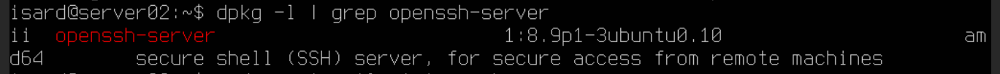 

Después verifico su estado, es decir, si esta activo, con `sudo systemctl status ssh` .

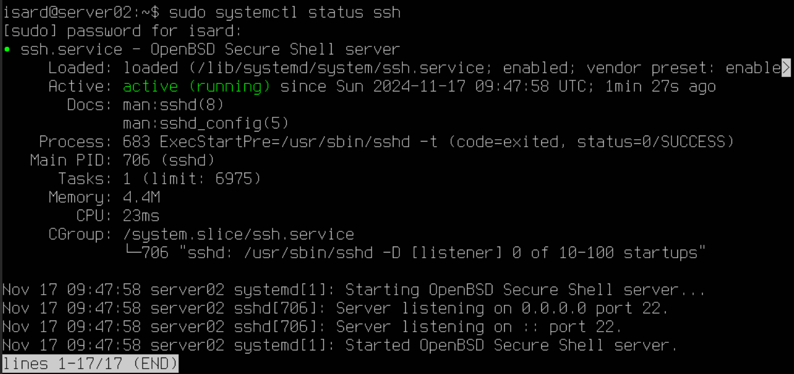 

Si no saliera **active** como en la imagen lo inicio así: `sudo systemctl start ssh`

Después verifico si el puerto SSH esta activo, es decir, esta escuchando en el
puerto predeterminado 22, será correcto si aparece algo así  0.0.0.0:22 o :::22.

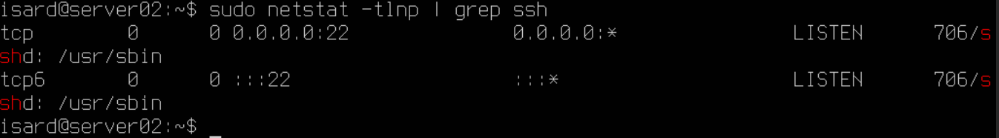 

### 1.2 - SSH no se encuentra instalado

Si no se encuentra instalado ejecuto estos dos comandos:
`apt update` y `apt install openssh-server`.

Si lo acabamos de instalar debemos iniciarlo con  `sudo systemctl start ssh`
y permitir su inicio en el arranque del equipo con `systemctl enable ssh` .

Si queremos cambiar ciertoa parametros o ver cierta información accedemos a
`sudo nano /etc/ssh/sshp_config` donde podemos cambiar por ejemplo el puerto
predeterminado en #Port 22.

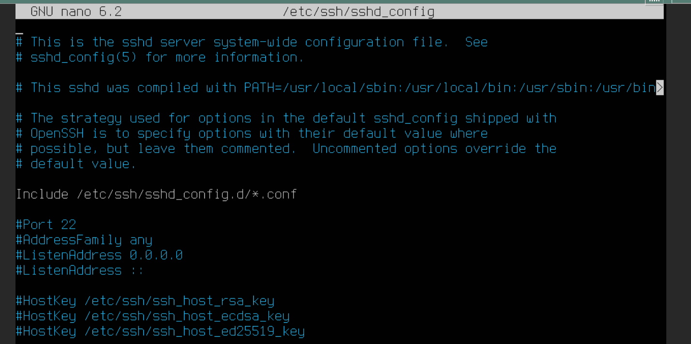 

Eso si, si se aplican cambios habrá que reiniciarlo con `sudo systemctl restart ssh` .

## 2 - Conexión y pruebas desde el cliente ubuntu

Previamente deberé tener una clave SSH en la maquina cliente, para ello la consiguo
con el comando `ssh-keygen` el cual me generará una nueva clave pudiendo sobreescribir
la existente o creando uan nueva especificando ruta y nombre:

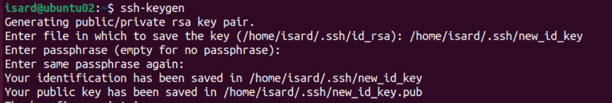 

Lo siguiente es crear la conexión entre el cliente y el servidor para usarse en adelante sin contraseña.
Para ello teniendo esto en cuenta: 
Clave privada: ~/.ssh/new_ssh_key → Es tu identificador único secreto. Debe mantenerse segura y no compartirse. 
Clave pública: ~/.ssh/new_ssh_key.pub → Es la parte que compartes con los servidores para autenticarte.

Con `ssh-copy-id` copio la **clave pública** de la maquina cliente en el archivo **authorized_keys** del servidor el cual almacena las claves públicas autorizadas para realizar la conexión, las guarda en la carpeta `~/.ssh/authorized_keys` de mi servidor siendo este **192.168.2.1**.
Una vez almacenada en futuras conexiones y transferencias leera la clave pública de **authorized_key** y la comparara con  la clave privada del cliente y si coinciden, te autentica sin pedir contraseña.

El comando completo es `ssh-copy-id -i ~/.ssh/new_ssh_key.pub isard@192.168.2.1` donde nos pedira una última vez la contraseña para confirmar.

***OJO - Uso -i seguido de la ruta por que estoy usando una keyhen alternativa*** si fuera la principal sería solo `ssh-copy-id isard@192.168.2.1`
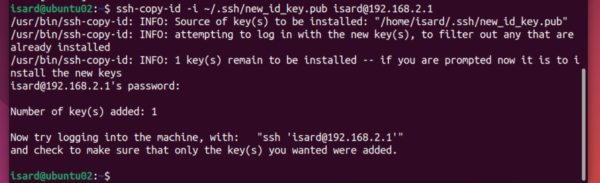  

También lo compruebo desde el lado cliente para verificar que el server esta escuchando y me puedo conectar de forma remota. 
Para conectarme se ultiliza el formato `ssh usuario@ip_del_servidor` o la que yo especifique `ssh -i ruta usuario@ip_del_servidor` 
en mi caso previamente configure la red para que esten en la misma, siendo la ip del servidor **192.168.2.1** y la del cliente
ubuntu la **192.168.2.3** al estar en la misma red pueden conectarse por ssh, el cliente es el del servidor, por tanto de ahi que el comando a usar desde el cliente sea `ssh isard@192.168.2.1` .

Si me he conectado correctamente recibiré un mensaje así:

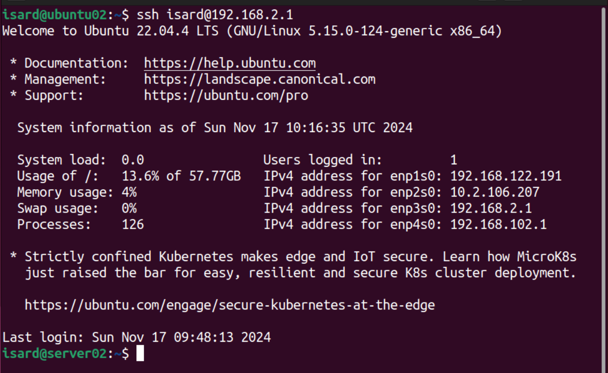  

Además habrá cambiado el nombre al der servidor:

Antes
  
Después
  

Esto con la ruta alternativa mi conecto sin pedirme la contraseña.

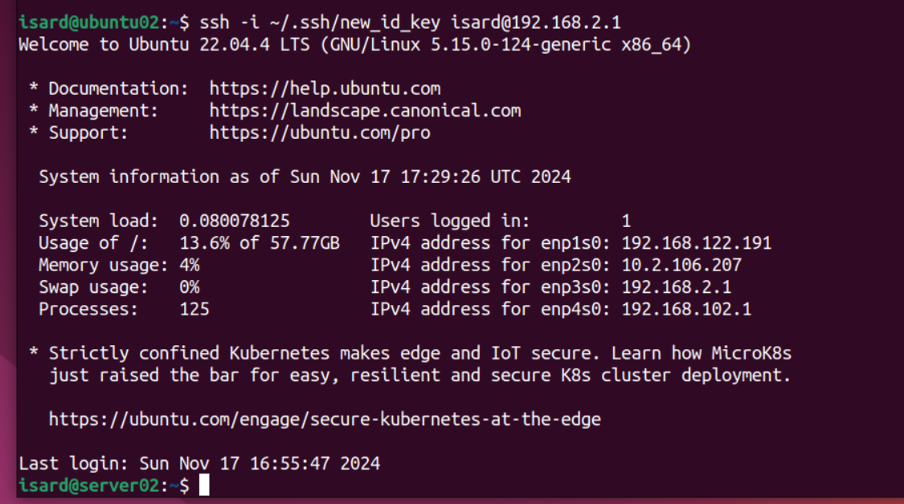  

En caso de haber cambiado el puerto o quere remarcar que se use el 22 se utiliza
este comando `ssh usuario@ip_del_servidor -p puerto` es decir `ssh isard@192.168.2.1 -p 22` .

**Muy importante con esto me conecto al servidor desde la maquina cliente, por tanto manejo el servidor
desde el cliente, es como si estuvieras dentro de una máquina remota. Cualquier comando scp que ejecuto 
desde aquí será para transferir archivos fuera del servidor, no hacia él. Por tanto si quiero mandar archivos
desde el cliente al servidor no he de conectarme a el, Si estás en tu máquina cliente, debes usar scp directamente 
la máquina local, sin necesidad de conectarte primero con ssh.

No necesitas hacer primero el ssh, porque scp por sí solo manejará la conexión SSH al servidor de destino y copiará el archivo. **

## 3 - Envio y transferancia de archivos entre el cliente ubuntu y el servidor.

Para enviar archivos al servidor desde el cliente utilizo el comando **scp**, el cual se utiliza para 
copiar archivos de manera segura entre sistemas remotos a través de SSH, siendo el comando completo:
`scp archivo usuario@ip_del_servidor:/ruta/destino` - `scp archivo.txt isard@192.168.2.1:/home/isard/descargas`.
`scp -i ~/.ssh/nombre_de_tu_clave_privada archivo.txt isard@192.168.2.1:/home/isard/destino/`
Sí no especifico un directorio de destino en el comando scp, el archivo se copiará al directorio home del usuario 
en el servidor, es decir, al directorio /home/isard/.

Para comprobarlo primero en el home del server hice `ls` para ver los archivos, después en el cliente cree un archivo
llamado **archivo_idkey.txt** y lo envie al server y después hcie `ls` de nuevo el el server y se ve al archivo.

  
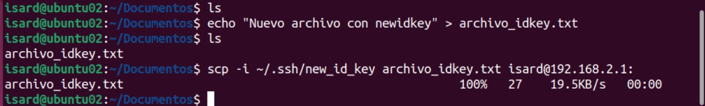  
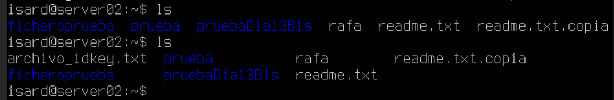  

Otro comando para transferencias es **rsync** rsync el cual es más eficiente que scp cuando se trata de sincronizar archivos, 
ya que solo transfiere los archivos que han cambiado (o los nuevos). Si un archivo ya existe y no ha cambiado, no lo volverá a copiar. 
Esto hace que las transferencias sean más rápidas y eficientes.
**Sc** en cambio, siempre copia los archivos completos, aunque no hayan cambiado. Si tienes una gran cantidad de archivos y 
algunos no han cambiado, **scp** sigue copiándolos, lo que puede ser más lento.

El comando es `rsync -az ~/ruta_cliente usuario_servdiro@ip_servidor:~/ruta_servidor`
`rsync -az ~/Desktop/Original isard@192.168.2.1:~/tmp/` 
Si quiero quiero crear un directorio en el home donde guardarlo en el server lo establezo asi: `rsync -az ~/Desktop/Original idard@192.168.2.1:~/Original/`
O bien establezo la ruta absoluta del server así: `rsync -az ~/Desktop/Original idard@192.168.2.1:/home/isard/Original/`
Con ruta alternativa sería `rsync -az -e "ssh -i /ruta/a/tu/clave_ssh" ~/Desktop/Original idar@192.168.2.1:~/Original/`

  
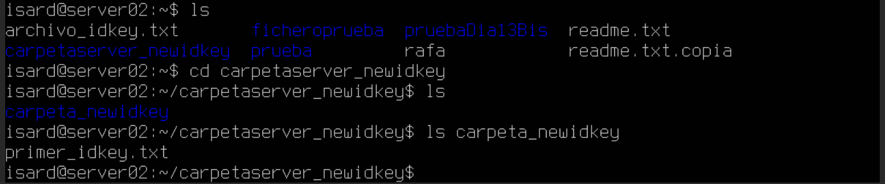  

Desde el servidor al cliente sería: `scp isard@192.168.2.1:/ruta/remota/del/servidor/archivo.txt ~/ruta/local/destino/`
alertnativa: `scp -i /ruta/a/tu/clave_ssh isard@192.168.2.1:/ruta/remota/del/servidor/archivo.txt ~/ruta/local/destino/`
